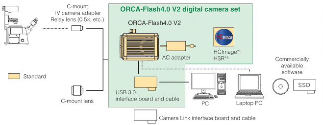

.. _camera-hamamatsu:

Hamamatsu
----------


Introduction
````````````

The Hamamatsu Orca flash is digital CMOS camera.
It supports USB3 or direct camera link connectivity.

 - USB 3.0    -> 30fps
 - Cameralink -> 100fps

The Lima plugin controls an Orca camera (**ORCA-Flash4.0 V2, C11440-22CU V2**) under Windows. It is based on the Hamamatsu DCAM-API SDK.

Prerequisite
````````````````````

Host OS is Windows (32 or 64 bits). The driver must be installed on the host system.

Installation & Module configuration
```````````````````````````````````

Follow the generic instructions in :ref:`build_installation`. If using CMake directly, add the following flag:

.. code-block:: sh

 -DLIMACAMERA_HAMAMATSU=true

For the Tango server installation, refers to :ref:`tango_installation`.

Initialization and Capabilities
```````````````````````````````

Implementing a new plugin for new detector is driven by the LIMA framework but the developer has some freedoms to choose which standard and specific features will be made available. This section is supposed to give you the correct information regarding how the camera is exported within the LIMA framework.

Camera initialization
......................
There is nothing specific.
The available cameras must first be enumerated. A selected camera can then be inited.
(Note that at the moment only one camera will be handled by the pluggin.)

Std capabilities
................

This plugin has been implemented in respect of the mandatory capabilites but with some limitations according to some programmer's choices.
We only provide here extra information for a better understanding of the capabilities of the Orca camera.

* HwDetInfo

 - Max image size is : 2048 * 2048
 - 16 bit unsigned type is supported
 - Pixel size: 6.5µm * 6.5µm
 - Detector type: Scientific CMOS sensor FL-400

* HwSync

 Supported trigger types are:

 - IntTrig
 - ExtTrigSingle
 - ExtGate (not yet implemented)
 
 
Output trigger
................

This plugin provide here capabilites to chnage output informations

* Kind

 Supported trigger Kind are : 
 
 - Low
 - Exposure
 - Programmable
 - Trigger Ready
 - High
 

* Polarity
 
 Supported trigger Polarity are : 
 
 - Negative
 - Positive

Optional capabilities
........................
* HwBin

 Possible binning values are:

 - 1 * 1
 - 2 * 2
 - 4 * 4

* HwRoi

 The Subarray mode allows defining a rectangle for ROI:

 - X: 0 to 2044
 - Width:  4 to 2048
 - Y: 0 to 2044
 - Heigth: 4 to 2048

* HwShutter

 - There is no shutter control available in the DCAM-API SDK.

* Cooling

 - There is no cooler sensor access or control to the cooling system via the DCAM-API SDK.
 - Cooling management is autonomous and can only be chosen between air or water cooling outside the sdk.

* Readout mode

 - Two readout modes are available: SLOW (30fps at full frame) or NORMAL (100fps at full frame).

Configuration
`````````````



How to use
``````````

The following set of functions is used as a wrapper to the DCAM-API SDK.
Code can be found in the HamamatsuDCAMSDKHelper.cpp file.

.. code-block:: cpp

	dcam_init_open();			// initialize DCAM-API and get a camera handle.
	dcamex_setsubarrayrect();		// Initialize the subarray mode (defines a ROI -rectangle-)
	dcamex_getsubarrayrect();		// Get the current subarray parameters (get ROI settings)
	dcamex_getimagewidth();			// Get the width of the image
	dcamex_getimageheight();		// Get the height of the image
	dcamex_getfeatureinq();			// Get the settings of a feature (ex: exposure time)
	dcamex_getbitsperchannel();		// Get the number of bits per channel
